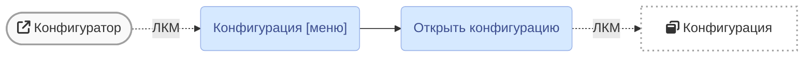
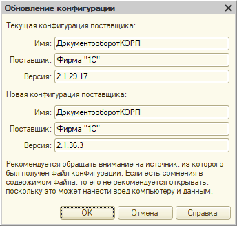
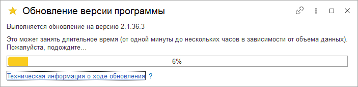

# Обновление платформы не изменяя информационную базу

|1C:Предприятие|8.3.24.1691
|:--- |:--- 
|Документооборот КОРП|2.1.29.17
|Расширение ДОАМ|[2.0.0]

[2.0.0]: https://github.com/kc-doam/doam.cfe/releases

``` note
Если конфигурация открыта, то пропустите пункт 1.
```

## Решение вопроса

``` tip
Перед выполнением действий создайте копию информационной базы.
```

1. Открыть `Конфигурацию` в режиме конфигуратора, - слева откроется окно  

``` tip
Если панель `Конфигурация` закрыта, то отобразить окно можно горячими клавишами [`Ctrl+Shift+C`](#)
```

2. Перед сравнением-объединением с новой версией удалить общие формы и регистры:  
	* ЗагрузкаДанныхИзСервиса  
	* АдресныеОбъекты  
``` note
В версии `2.1.29` вместо перечисленных добавлены объекты с такими же именами, но с другой структурой.
```

3. В действительности с конфигурацией от стороннего производителя будет сделать невозможно,  
поэтому сразу запустить `Обновить конфигурацию...` и меню `Поддержка`.  


4. Выбрать файл обновления, который по умолчанию скачивается в директорию 
`%AppData%\1C\1cv8\tmplts\1c\`, и нажать кнопку `Готово`, затем `Продолжить обновление`.  

5. Необходимо сравнить поставщика обновления, нажать кнопку `ОК` и подождать сравнение конфигураций.  

``` note
После появления окна необходимо найти и установить галки напротив объектов, указанных в пункте 2. Затем нажать кнопку `Выполнить`.  
На сообщение `Будет произведена замена объектов. Продолжить?` ответить `Да`, затем нажать `OK`.  
Расширение в режиме "адаптация" перед обновлением отключать не требуется.  
```
После появления сообщения с реорганизацией базы (после реструктуризации) нажмите кнопку `Принять`.  

6. После обовления конфигурации нажать клавишу `F7`.  
В результате успешного обновления во время очередного запуска информационной базы 
появится сообщение с обновлением, а затем и сообщение с окончанием обносления.  


7. Режим совместимости расширения конфигурации `Не использовать`.  
Режим совместимости `Не использовать`.

