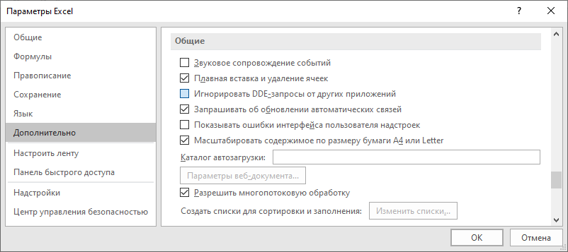

# Вместо открытия файла видно пустое окно

|MS Excel|16.0.4266.1001
|:--- |:--- 
|Формат|csv, xls, xlsm, xlsx

``` danger
**2022-01-17**  
В Windows 10 при открытии файла Excel вместо данных приложение открывает пустое окно.  
Проблема может возникать после [обновления Windows](//ru.wikipedia.org/wiki/WSUS) (без уведомления пользователя).
```

## Разрешение конфликта

1. В запущенном приложении открыть Параметры Excel.   



2. Найти настройку `Игнорировать DDE-запросы от других приложений` и снять галку.

3. Нажать `Ок`. Проблема должна разрешиться.

