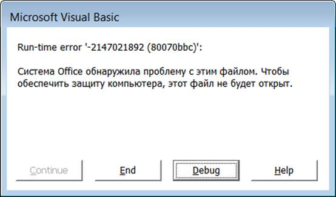
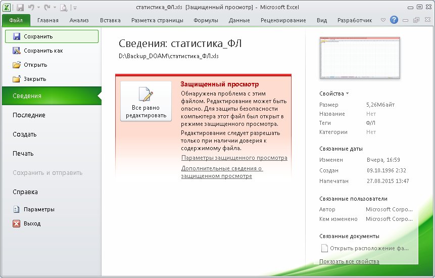

# Ошибка чтения макросом файла

|MS Excel|14.0.7015.1000
|:--- |:--- 
|Формат|xls

``` danger
**2021-09-15**  
Ошибка 80070bbc возникает из-за работы с книгой в различных версиях Excel.  

```

## Разрешение конфликта

1. Добавить атрибут `Только чтение` для рабочей книги на сетевом диске.

2. Скопировать рабочую книгу во временную папку на локальный диск.

3. Открыть книгу, и разрешить редактирование.  



4. Сохранить книгу в формате `xlsm`. Затем открыть книгу и сохранить в исходном формате `xls`.

5. Заменить рабочую книгу на сетевом диске полученной копией книги с восстановленной структурой.

