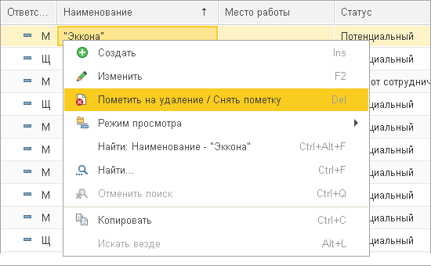

# Удалить контрагента

|1C:Предприятие|8.3.17.1851
|:--- |:--- 
|Документооборот КОРП|2.1.10.2
|Расширение ДОАМ|[1.2.1]

[1.2.1]: https://github.com/kc-doam/doam.cfe/releases

``` warning
**2021-05-20**  
Удалить карточку контрагента. Удалить запись в таблице.
```

## Решение вопроса

Чтобы удалить карточку контрагента нужно нажать клавишу 
[`Delete`](#{{ page.url }}). Вместо удаления в базе к записи контрагента 
применяется специальная метка "*на удаление*" (в списке на `Главной странице` 
появляется *красный круг*).  



То же самое относится к записям во вкладках `Документы` и `Контактные лица`.

``` note
Перед удалением карточки контрагента в поле `Комментарий` нужно указать причину.
```

Если нажать клавишу [`Delete`](#{{ site.baseurl }}) во вкладке 
`История взаимодействия`, за запись удалится без подтверждения.

